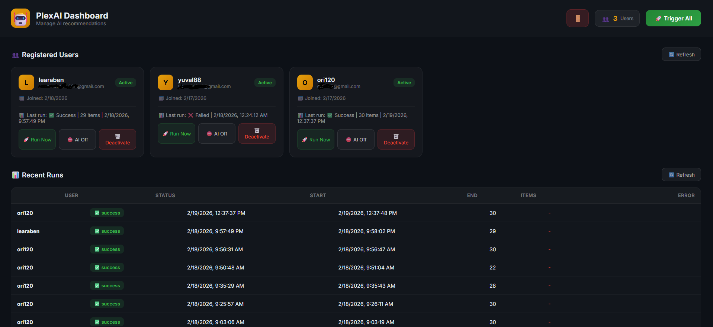
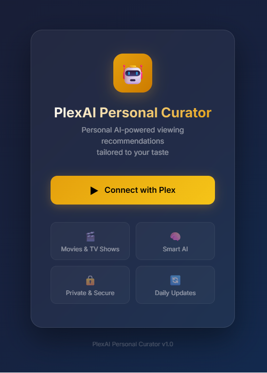

# PlexAI Personal Curator

[](https://www.python.org/)
[](https://fastapi.tiangolo.com/)
[](https://www.postgresql.org/)
[](https://www.docker.com/)

AI-powered personal recommendations for Plex users, with automatic playlist updates based on watch history.

## Table of Contents

- [What This Project Does](#what-this-project-does)
- [Core Features](#core-features)
- [Screenshots](#screenshots)
- [Tech Stack](#tech-stack)
- [Architecture (High-Level)](#architecture-high-level)
- [Prerequisites](#prerequisites)
- [Quick Start (Docker)](#quick-start-docker)
- [Environment Variables](#environment-variables)
- [Finding Plex Library IDs](#finding-plex-library-ids)
- [Admin API (Current Auth Model)](#admin-api-current-auth-model)
- [Local Development (Without Docker)](#local-development-without-docker)
- [Notes and Limitations](#notes-and-limitations)
- [Troubleshooting](#troubleshooting)
- [Project Structure](#project-structure)

## What This Project Does

PlexAI Personal Curator lets users connect their Plex account, analyzes their watch behavior, and generates personalized movie/show recommendations using an LLM (via OpenRouter).  
It then updates Plex playlists automatically (daily scheduler + manual admin triggers).

## Core Features

- Plex OAuth login flow for end users
- Personalized recommendations from local library content only
- Watch-history analysis (Plex + Tautulli)
- Automatic playlist creation/update in Plex
- Daily scheduler (APScheduler)
- Admin dashboard for user/run visibility and operational controls
- Manual recommendation triggers (single user / all users)
- User activation/deactivation and recommendation toggle controls

## Screenshots

### Login / Connect Screen



### Admin Dashboard



## Tech Stack

- Python 3.12
- FastAPI + Uvicorn
- SQLAlchemy (async) + PostgreSQL
- APScheduler
- httpx
- OpenRouter (LLM provider)
- Docker + Docker Compose

## Architecture (High-Level)

1. User opens `/` and starts Plex login.
2. App creates Plex PIN + authorization URL.
3. User authorizes in Plex.
4. App stores user token and profile in Postgres.
5. Recommendation pipeline:
   - Collect watch history and available content
   - Remove watched items
   - Ask LLM for recommendations (strict JSON format)
   - Validate and correct IDs against actual library content
   - Create/update Plex playlists
   - Save recommendation run metadata

## Prerequisites

- Docker + Docker Compose (recommended)
- A reachable Plex server
- Tautulli instance with API access
- OpenRouter API key

## Quick Start (Docker)

1. Clone the repo.
2. Copy environment template:

```bash
cp .env.example .env
```

3. Edit `.env` and set real credentials.
4. Start services:

```bash
docker compose up --build -d
```

5. Open the app:
   - User login page: `http://localhost:8889/`
   - Admin dashboard: `http://localhost:8889/admin`
   - Health check: `http://localhost:8889/health`

## Environment Variables

Use `.env.example` as baseline.

### Required

- `PLEX_SERVER_URL` - Plex base URL, e.g. `http://your-plex-server:32400`
- `PLEX_ADMIN_TOKEN` - Plex admin token (used for server-level operations)
- `TAUTULLI_URL` - Tautulli base URL
- `TAUTULLI_API_KEY` - Tautulli API key
- `OPENROUTER_API_KEY` - OpenRouter API key
- `DATABASE_URL` - Async SQLAlchemy URL, e.g. `postgresql+asyncpg://...`
- `POSTGRES_PASSWORD` - Postgres password (compose service)
- `SECRET_KEY` - App secret key
- `ADMIN_PASSWORD` - Admin API password (sent in `X-Admin-Password`)

### Optional

- `OPENROUTER_MODEL` (default: `anthropic/claude-sonnet-4`)
- `POSTGRES_USER` (default: `plexai`)
- `POSTGRES_DB` (default: `plexai`)
- `RECOMMENDATION_HOUR` (default: `3`)
- `RECOMMENDATION_MINUTE` (default: `0`)
- `PLAYLIST_SIZE` (default: `15`)
- `ENABLE_SCHEDULER` (default: `true`)
- `ALLOWED_LIBRARIES` - Comma-separated Plex library IDs to limit recommendation sources (example: `1,4,7`)

### `ALLOWED_LIBRARIES` Example (`1,2`)

If your Plex libraries are:

- `1` = Movies
- `2` = TV Shows

Set:

```env
ALLOWED_LIBRARIES=1,2
```

Meaning:

- The recommendation pool will include only content from libraries `1` and `2`.
- Content from other libraries will be ignored for recommendation selection.
- Watch history is also built from the allowed libraries only.

## Finding Plex Library IDs

To list available libraries and IDs:

```bash
python list_libraries.py
```

Use the output with `ALLOWED_LIBRARIES` if you want to limit recommendation pools.

## Admin API (Current Auth Model)

Admin endpoints are under `/api/admin/*` and currently use header-based auth:

- Header: `X-Admin-Password: <ADMIN_PASSWORD>`

Key endpoints:

- `GET /api/admin/users`
- `GET /api/admin/runs?limit=20`
- `POST /api/admin/trigger/{user_id}`
- `POST /api/admin/trigger-all`
- `DELETE /api/admin/users/{user_id}`
- `PATCH /api/admin/users/{user_id}/toggle-recommendations?enable=true|false`

## Local Development (Without Docker)

1. Create virtualenv and install deps:

```bash
python -m venv .venv
source .venv/bin/activate
pip install -r requirements.txt
```

2. Provide env vars (or `.env`).
3. Make sure PostgreSQL is running and `DATABASE_URL` is valid.
4. Start app:

```bash
uvicorn app.main:app --host 0.0.0.0 --port 8000 --reload
```

## Notes and Limitations

- Database tables are created automatically at startup (`Base.metadata.create_all`).
- Recommendation quality depends on:
  - Rich Plex metadata
  - Tautulli history quality
  - OpenRouter model behavior
- Admin authentication is currently simple header password auth (suitable only for trusted/private environments).

## Troubleshooting

- `401 Invalid admin password`:
  - Verify `ADMIN_PASSWORD` in `.env`
  - Ensure the request sends `X-Admin-Password`
- Plex login stuck on pending:
  - Confirm Plex server URL/token are valid and reachable from the app container
- No recommendations returned:
  - Verify `OPENROUTER_API_KEY`
  - Check app logs for JSON parsing / ID mismatch warnings
- Empty content pool:
  - Verify Plex user access to libraries
  - Check `ALLOWED_LIBRARIES` filtering is not too restrictive

## Project Structure

```text
app/
  api/          # FastAPI routes (auth, admin, users)
  services/     # Plex, Tautulli, AI, playlist, feedback services
  tasks/        # Scheduler + recommendation pipeline
  static/       # User login UI + admin dashboard UI
  config.py     # Environment settings
  database.py   # Async DB engine/session setup
  models.py     # SQLAlchemy models
```
